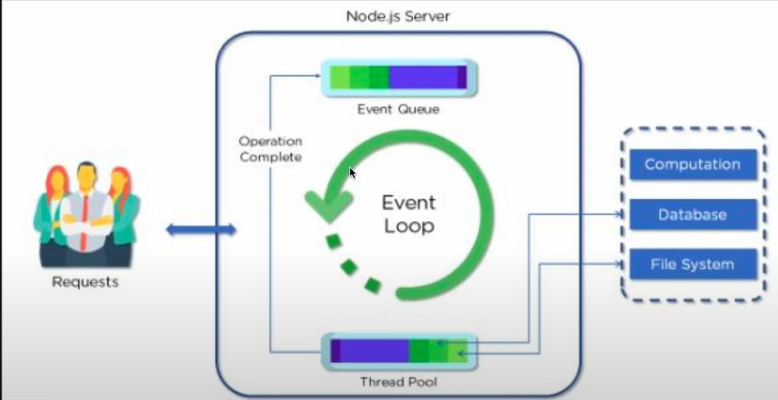
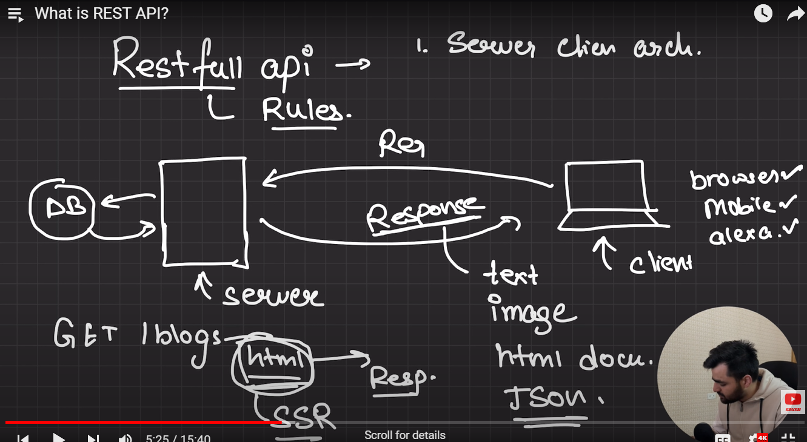

### Day 1

## Defination: Node js ia an opensource and crossplatform runtime environment.

## Why NodeJs: 

- Can run js outside of the browser.
- Js can talk to native machine because of c++ (file handling etc.)
- You can create webserver in JS language.

## Disadvantages:

- Cannot use the DOM concept and browser related concept.
  
## Installation and setUp

- www.nodejs.org
- download node package (LTS)
- Check the version in terminal to verify the setup (node -v)

## First code

- npm init
- create a starting point of the project to execute (index.js)
- Install nodemon (npm i nodemon)
- In package.json define the script run command(like "start": "node index.js")
- If other then start then we have use this command to run it (npm run name of the script)

### Day 2

## Modules 

- Modules are functions or package
- To import a module we have to export the module which we want to import

## Importing a module

- Eg: `const name = require('file/package')`
- Destructuring `const {add,sub} = require('file/package')`

## Exporting a module 

- Two types

# Default export

- `module.exports = {fun1,fun2}`

# Object export

- `exports.add = (a,b) => a+b`


## File Handler:

- Refere FileHandler.js


### Day 3

## Node Js Architecture



# Event Queue:
- All the request are queued here.

# Event Pool:
- Watch over the event queue to check for the request, if any request it takes the request for processing.
- FIFO
- Also checks if the request is blocking or non-blocking operation.


# Non-blocking operation(Async):

- The request will be directly processed and response will be sent.

# Blocking operation:

- The request are sent to the thread pool and waits untill the thread has been asigned for processing.

# Thread pool:
- A pool which contains threads.
- Responsible for fulfilling the blocking operation.

# Work flow of blocking operation:

- When the request occurs it checks for the available thread, if any then the request will be processed by a thread and sends the response.


## Note:

- Always try to use non-blocking operation(Async).
- By default there will be 4 threads.
- The size of the thread pool depends on the CPU core.
- eg. if its a 4 core CPU then 4 threads, 8 core = 8 threads.
  
# Disadvantage of using Blocking operation:
- Scalability issue: If all the threads are occupied the new request has to wait untill any one of the thread is free.


## OS Module:

- Used to get the information about the local system.
  
  `const os = require('os')
   console.log(os.cpus().length)
  `

## Bulding HTTP server in node js

- By using http module we can create a server.
- ```const http = require('http')

const myserver = http.createServer((req,res)=>{
    console.log(req)
    res.end("Display on the browser")
    
});

myserver.listen(8000,()=>
console.log("Server is running!!"))```

# Note: The serve will load twice due to the favicon.ico

## Handling URL's in Node js

- URL - Uniform Resource Locator
- eg: https:/demo.dev/about
- hear https - a protocol (Hypertext Transfer Protocol Secure)
- demo.dev - Domain(User friendly name of an IP address)
- /about - path
- /about/user - nested path
- /about?name=karthik&id=1 - After ? is a query parameter,where we are passing name and id as parameter and & is used as seperator
- In node js to use URL we have to download external package from npmjs.com
- Download URL package.


### Day 4

## HTTP Methods

- Get
- Post
- Put
- Patch
- Delete 

### GET

- When you want to get some data from the server.

### POST

- When you want to send and mutate some data in server.
- Create a new resources.
- eg. Form etc.

### PUT

- PUT is used to send data to a server to create/update a resource.
- Also used to overwrite all fields.

### PATCH

- This request is made when we want to change the existing data.
- The PATCH is used to replace only the information sent in the call.

### DELETE

- To delete a data.

### Difference between POST and PUT 

- The difference between POST and PUT requests are idempotent. That is, calling the same PUT request multiple times will always produce the same result.
- In contrast, calling a POST request repeatedly have side effects of creating the same resource multiple times.


## Express Js (Framework):

- Fast, unopinionated, minimalist web framework for Node js.

## Versioning in Node js

- Current Express js version - ^4.19.2

- ^ (It is for package.json while installing npm module based on the package.json, it will make sure the 1st part should remain same)- Compatable with version.
- ~ - it make sure both first and second part remain same while installing npm module based on package.json.
- If no symbol then the version is fixed.

- 1st part(Major release/ Breaking Update) -> 4  
  
- 2nd part((Recommended) bug or security fix)-> 19 When new feature has been added or bug fix


- 3rd part(Minor fixes)(optional) -> 2 
  

## REST API

- RESTfull API or REST API
- Representational State Transfer(REST API) 
- Standard rules to follow

# Rules:

# Rule 1:

- 
- Server and client(Browser or mobile) are seperate different entities, which does not depends on each other.
- ie. Server should not depend on client or vice versa.
- 
  
- If the client request for the data and the server fetches from DB and process(SSR - Server Side Rendering) it in the html form or any other then it is dependent architecture.
- It does not support cross-platform 
- Faster compare to independent due to SSR

- Similarly, if the  client request for the data and the server fetches from DB and sends the raw data(JSon(latest) or xml(oldest)) so the client can do whatever they want on the client side(CSR - Client Side Rendering) it is called Independent architecture.
- Support cross-platform
- Due to CSR slower compare to SSR (Because the raw data has to be rendered in client side)
- Followed by REST API.

# Rule 2:

- Always respect all HTTP request.
- Eg. Instead of patch request don't use post request to update the existing entry.


### Day 5

## Building a REST API's using NODE JS and EXPRESS JS

- Refer Task.txt contains the details of route which i am creating.
- For data visit the website named [Mokaroo](https://www.mockaroo.com/)
- Refer server.js for the code
- Created a middleware to handle incomming data from the browser.

## POSTMAN 

- To test the API routes

# Status

- 200 - ALL OK